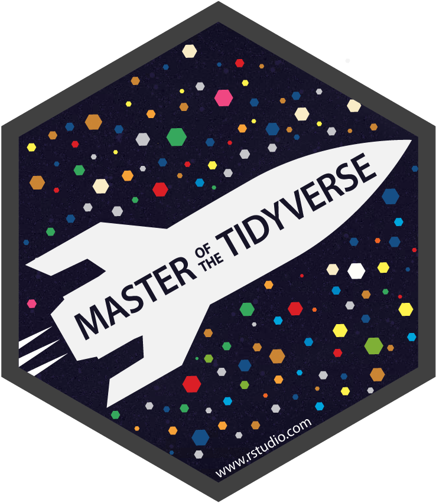

```{r metathis, echo=FALSE}
library(metathis)
meta() %>%
  meta_name("github-repo" = "") %>% 
  meta_social(
    title = "Vinicius Santos CV",
    description = paste(
      "CV made with the packages RMarkdown, pagedown, datadrivencv."
    ),
    url = "",
    image = "",
    image_alt = paste(
      "Vinicius Santos CV"
    ),
    og_type = "website",
    og_author = "Vinicius Santos",
    twitter_card_type = "summary_large_image",
    twitter_creator = "@santosvtito"
  )
```
<!-- inicio academic icons -->
<link rel="stylesheet" href="https://cdn.jsdelivr.net/gh/jpswalsh/academicons@1/css/academicons.min.css">
<!-- final academic icons -->

 
<!-- inicio font awesome -->
<script src="https://kit.fontawesome.com/1f72d6921a.js" crossorigin="anonymous"></script>

 
<!-- final font awesome -->

```{r, include=FALSE}
knitr::opts_chunk$set(
  results='asis',
  echo = FALSE
)

library(magrittr) # For the pipe
source("cv_printing_functions.r")

# Read in all data and initialize a CV printer object
CV <- create_CV_object(
  data_location = "https://docs.google.com/spreadsheets/d/1AB7O9x6_Su1-hVLiL0EnB_hPGpS5XlYY45rKtWnwNEo",  
  pdf_mode = params$pdf_mode
)

```


```{r}
# When in pdf export mode the little dots are unaligned, so fix that with some conditional CSS.
if(params$pdf_mode) {
    cat("
<style>
:root{
  --decorator-outer-offset-left: -6.5px;
}
</style>")
}
```


Aside
================================================================================

```{r}
# Build interactive network of positions colored by section
# and connected if they occurred in the same year
datadrivencv::build_network_logo(CV$entries_data)
```


```{r}
if(params$pdf_mode){
  cat("View this CV online with links at https:")
} else {
  cat("<i class='fas fa-download'></i> [Download this resume in PDF](https:/).")
}
```


Programming Skills {#skills}
--------------------------------------------------------------------------------

<i class="fab fa-r-project"></i> `R`

```{r echo=FALSE, out.width="5%"}

```
`tidyverse`

<i class="fas fa-code-branch"></i> `Git`

<i class="fab fa-github"></i> `GitHub`

<i class="fab fa-markdown"></i> `Markdown`

```{r echo=FALSE, out.width="5%"}
knitr::include_graphics("img/igraph.png")
```
`igraph`


::: aside

### Languages

**Portuguese:** Native

**English:** Proficient

**Spanish:** Beginner

:::


Disclaimer {#disclaimer}
--------------------------------------------------------------------------------

This resume was made with the R package [**pagedown**](https://github.com/rstudio/pagedown) and [**datadrivencv**](http://nickstrayer.me/datadrivencv/index.html).

Code available on <i class="fa fa-github"></i>  [GitHub](https://). 

Last updated on `r Sys.Date()`. The most recent version of this resume is [available here](https:). 


Main
================================================================================

Vinicius Santos {#title}
--------------------------------------------------------------------------------

I have been working on an interface between Political Science and Network Science to understand Government Affairs; Foreign, and Public Policy. Since then, I have been involving myself in projects with a thematic and methodological plurality on themes related to a series of Latin American foreign policies with an emphasis on Brazil. In terms of Network Science themes like Innovation, Knowledge, Transfer, and Diffusion on complex systems are on top of my interests.

Industry positions {data-icon=share-alt}
--------------------------------------------------------------------------------

```{r}
CV %<>% print_section('industry_positions')
```


Education {data-icon=graduation-cap data-concise=true}
--------------------------------------------------------------------------------

```{r}
CV %<>% print_section('education')
```

::: aside

During the Ph.D. research I have been working on the relationship between the chief of Executive and bureaucracy in Brazil’s Foreign Policy. In this opportunity,  establishing a dialogue with political control literature to understand mechanisms of control in a “presidential toolbox” as agency design, political nominations, and career progression on Brazilian Foreign Office known as “Itamaraty”

:::


Research Projects {data-icon=laptop}
--------------------------------------------------------------------------------

```{r}
CV %<>% print_section('research_projects')
```


Teaching Experience {data-icon=chalkboard-teacher}
--------------------------------------------------------------------------------

```{r}
CV %<>% print_section('teaching_experience')
```

::: aside

### GRANTS

- <i class="far fa-star"></i> [MacroUniversities of Latin America and Caribbean Network - 2017](http://www.redmacro.unam.mx/). Scholarship - Travel and Visiting Student.

- <i class="far fa-star"></i> [CAPES Doctorate Scholarship](https://www.uab.capes.gov.br/bolsas/bolsas-no-pais/proex)

- <i class="far fa-star"></i> [CAPES Master Scholarship](https://www.uab.capes.gov.br/bolsas/bolsas-no-pais/proex)

:::

Scientific Journals {data-icon=book }
--------------------------------------------------------------------------------

```{r}
CV %<>% print_section('scientific_journals')
```


::: aside

### CONTACT

- <i class="fa fa-envelope"></i> santos.vinicius18@gmail.com

- <i class="fa fa-twitter"></i> [Twitter: `@`santosvtito](https://twitter.com/santosvtito)

- <i class="fa fa-github"></i> [GitHub: `@`vsntos](https://github.com/vsntos)

- <i class="fa fa-external-link-alt"></i> <a href='http://buscatextual.cnpq.br/buscatextual/visualizacv.do?id=K4629758Z1'> Lattes </a> 

- <i class="fab fa-orcid"></i> [Orcid](https://orcid.org/0000-0003-0907-7832) </a>

- <i class="fa fa-home"></i> [vsntos.github.io](vsntos.github.io)

:::